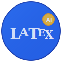

<div align="center">
  
  
  # AutomaTeX
  
  **LLM-Enhanced LaTeX Editor with Local Processing**
  
  [](https://www.python.org/)
  [](LICENSE)
  [](#)
  
  [Installation](#installation) • [Quick Start](#quick-start) • [Features](#features) • [Documentation](#documentation)
</div>

---

## Overview

LaTeX is often the hub of many, many knowledge.
AutomaTeX is a modern LaTeX editor designed for researchers, students, and technical writers who need LLM assistance (rephrasing, debugging trashy errors, generating complex maths...) without compromising privacy. LLM processing happens locally using Ollama, ensuring your documents never leave your machine.

**Core Value Propositions:**
- **Privacy-First LLM**: Local processing with no data transmission to external services
- **Performance Optimized**: Differential syntax highlighting and optimized rendering for large documents
- **Integrated Workflow**: Built-in PDF preview with live compilation and synchronization
- **Professional Focus**: Clean interface designed for productive academic and technical writing

(As local LLMs are both limited by your GPU capacity and the fact they have to be open source, it may not be enough for complex needs, thus the app features the Gemini API, which is in my opinion one of the best options for free usage with (very) generous quotas, although your data leaves your hands. If it is not important for your usecase, the Gemini API will perform way faster and better as local LLMs. LLMs real costs are sadly extremely expensive and it is hard to get the same output as providers on your machine.)

---

## Demonstrations

*Future demonstration videos will be avLLMlable here:*

<!-- Video demonstrations will be added to the readme/ folder -->
<!-- https://github.com/user-attachments/assets/video-file-name.mp4 -->

**Planned Demonstrations:**
- LLM-assisted document creation workflow
- Real-time PDF preview and synchronization  
- Advanced editing features and shortcuts
- Error debugging and correction process

---

## Features

### LLM-Powered Writing Assistant
- **Text Completion**: Context-aware sentence and paragraph completion
- **Content Generation**: LLM-generated text from prompts and outlines
- **Intelligent Rephrasing**: Style and clarity improvements for selected text
- **Document Translation**: Multi-language translation capabilities
- **Debug Assistance**: LLM-powered LaTeX error analysis and suggestions

### Editor and Interface
- **Advanced Syntax Highlighting**: Differential highlighting system optimized for performance
- **Document Navigation**: Integrated outline view with section jumping
- **Multi-tab Support**: Efficient tab management with weak reference tracking
- **Theme Support**: 15 themes writing with you in the brightest days and the darkest nights of typesetting
- **Zoom Control**: Text scaling for accessibility and preference

### LaTeX Integration
- **Live PDF Preview**: Real-time compilation with synchronized viewing
- **Error Management**: Intelligent error parsing with user-friendly messages
- **Image Management**: Automatic image paste with LaTeX code generation
- **File Organization**: Smart directory structure and unused file cleanup
- **Template System**: Extensible document templates and snippets

### Performance and Architecture
- **Large Document Support**: Optimized for documents with 2000+ lines
- **Memory Efficient**: Weak reference management and intelligent caching
- **Modular Design**: Clean separation between UI, editor, and LLM components
- **Background Processing**: Non-blocking compilation and LLM operations

---

## Installation

### Prerequisites

| Component | Purpose | Installation |
|-----------|---------|--------------|
| **Python 3.8+** | Application runtime | [Download Python](https://www.python.org/downloads/) |
| **LaTeX Distribution** | Document compilation | [MiKTeX](https://miktex.org/) (Windows) • [MacTeX](https://www.tug.org/mactex/) (macOS) • [TeX Live](https://www.tug.org/texlive/) (Linux) |
| **Ollama** | Local LLM engine | [Download Ollama](https://ollama.com/) |

### Setup Instructions

```bash
# Clone the repository
git clone https://github.com/your-username/AutomaTeX.git
cd AutomaTeX

# Install Python dependencies
pip install -r requirements.txt

# Download recommended LLM models
ollama pull mistral
ollama pull codellama:7b-instruct

# Launch the application
python main.py
```

---

## Quick Start

1. **Launch Application**: Run `python main.py`
2. **Create Document**: File → New or Ctrl+N
3. **Enable LLM**: Ensure Ollama is running with downloaded models
4. **Write Content**: Use the editor with syntax highlighting
5. **LLM Assistance**: Ctrl+Shift+G for generation, Ctrl+Shift+C for completion
6. **Compile**: Click "Compile" button for PDF generation
7. **Preview**: PDF automatically opens in integrated viewer

### Key Shortcuts

| Function | Shortcut | Description |
|----------|----------|-------------|
| Casual editor shortcuts | you know them | Not very original |
| LLM Completion | Ctrl+Shift+C | Complete current context |
| LLM Generation | Ctrl+Shift+G | Generate from prompt |
| Rephrase Text | Ctrl+R | Improve selected text |
| Paste Image | Ctrl+Shift+V | Insert image with LaTeX code |
| Zoom In/Out | Ctrl+±/Ctrl+- | Adjust text size |

---

## Code quality

AutomaTeX follows a modular architecture with clean separation of concerns!

Some examples:

```
app/                    # GUI components and application state
├── main_window.py     # Primary window and configuration
├── interface.py       # Central LLM+UI orchestrator
├── panels/            # Integrated sidebar panels for LLM interactions
└── state.py           # Global application state management

editor/                 # Text editing engine and LaTeX support
├── syntax.py          # Differential syntax highlighting
├── tab.py            # Editor tab management
└── monaco_optimizer.py # Performance optimizations (Microsoft monaco like)

latex/                  # LaTeX compilation and processing
├── compiler.py        # pdflatex integration (the casual subprocess command !)
├── error_parser.py    # Error analysis and reporting (handling the trashy logs)
└── translator.py      # Document translation services (huggingface local models (Helsinki MTP Opus))

llm/                    # LLM integration layer (business logic only)
├── service.py         # Centralized LLM API facade
├── api_client.py      # Ollama and external API communication
└── completion.py      # LLM feature implementations

pdf_preview/            # Integrated PDF viewer
├── manager.py         # PDF compilation and sync (from the RAM)
├── viewer.py          # PDF rendering and display ("virtualised" from the RAM)
└── interface.py       # main application integration
```

I wanted an extreme separation of the code so as to build them separately on single-responsibility.

The code quality is honestly good - but not perfect. 

## Performances

Obviously, Tkinter limits me a bit but that was the easiest way to start and the performances were good once I optimized it a bit. 
I really wanted to make the app in Python as it's often the easiest way to deal with AI libraries (especially for the huggingface model translation). I know it is not the best and I probably wouldn't have gone for this if I were to dev this again!

- Syntax highlighting was kind of a struggle but once you apply the methods of big editors like Microsoft Monaco (diff rendering, hashing) it becomes quite fast !
- The app consumes 450mb of ram (non dependent of file size), which is good for an app containing LLM initialization.

### Design Principles

- **Performance First**: Differential highlighting and optimized rendering
- **Privacy Focused**: All LLM processing happens locally
- **Modular Architecture**: Clean interfaces between components
- **Professional UI**: No popup dialogs - all features in integrated panels

---

## Limitations and Considerations

**Technical Requirements:**
- Requires local installation of LaTeX distribution (several GB)
- LLM features depend on Ollama service running locally
- Performance varies significantly with avLLMlable system resources
- Large language models require substantial RAM (8GB+ recommended)

**Functional Limitations:**
- Limited to LaTeX document format (no WYSIWYG editing)
- To be frank, local LLMs are much worse than state of the art models. I have a nice GPU (RTX 4060) and it still struggles. No wonder why LLMs are very costly to the providers...
- Local LLMs are not powerful enough to proofread documents. They just can't produce good json and after some tests, can't be trusted for a good review, missing out on non-relevant informations. Gemini 2.5 flash scored good scores for my tests with a reasonable speed (The proofreading prompt is enormous as any mistake is not allowed), thus the proofreading can't really be ran locally with trusteable results.
- No collaborative editing or cloud synchronization features
- PDF preview requires additional system dependencies (pdf2image, poppler)
- PDF *plumbering* turns out to be quite hard. TeXstudio way is magnificient and I couldn't reproduce their results.

**Learning Curve:**
- Assumes familiarity with LaTeX syntax and document structure  
- LLM feature configuration requires understanding of model capabilities and sometimes prompting
- Advanced features may require command-line comfort for troubleshooting

**Platform Considerations:**
- Windows users may experience longer setup time due to LaTeX installation
- macOS requires Xcode command line tools for some dependencies
- Linux users need manual installation of poppler-utils for PDF rendering

**Performance Trade-offs:**
- Large documents (1000+ pages) may experience slower compilation
- Multiple LLM models consume significant disk space (5-10GB per model)

---

## Configuration

### LLM Model Management

Configure LLM models through Settings → Manage Models:

- **Completion Model**: For sentence-level completion (recommend: mistral or codellama)
- **Generation Model**: For paragraph and section generation (recommend: mistral)
- **Rephrase Model**: For style and clarity improvements (recommend: mistral)
- **Debug Model**: For LaTeX error analysis (recommend: codellama)
- **Proofreading Model**: For academic correctivity (recommend: gemini 2.5 flash or mixtral)

### Performance Tuning

For large documents, adjust these settings:
- Enable Monaco optimizations for files over 2000 lines
- Reduce LLM streaming frequency for slower systems
- Configure PDF compilation timeout for complex documents

---

## Development and Contributing

### Development Setup

```bash
# Install development dependencies
pip install -r requirements.txt
```

### Architecture Guidelines

- LLM modules provide pure business logic with callback support
- UI orchestration handled exclusively in `app/interface.py`
- No direct UI imports in `llm/` modules
- MLLMntLLMn clean separation between editor and LLM components

---

## License

This project is licensed under the Apache 2.0 License - see the [LICENSE](LICENSE) file for detLLMls.

---

<div align="center">
  <strong>AutomaTeX: Professional LaTeX editing with local LLM assistance</strong>
  <br><br>
  <a href="#installation">Get Started</a> • 
  <a href="https://github.com/your-username/AutomaTeX/issues">Report Issues</a> • 
  <a href="#development-and-contributing">Contribute</a>
</div>